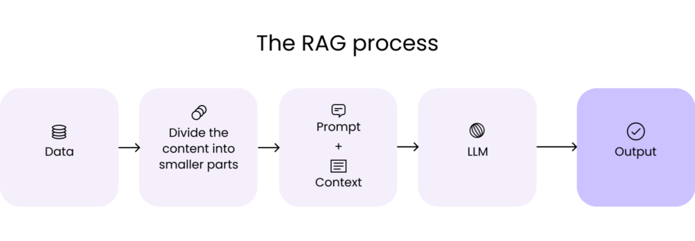

# RAG Natural Language Processing

## Anggota Kelompok
| Nama | NIM |
| -- | -- |
| Alex Cinatra Hutasoit | 22/505820/TK/55377 |
| Ryan Krsihandi Lukito | 22/497249/TK/54488 |
| Yefta Nathaniel | 22/492878/TK/53594 |

## File and How To Use
| File Name | Use |
| -- | -- |
| testanswer.py | to test the prompt and see the template prompt overview |
| scrapInformation.py | to gain and store into text document from web document `(https)` such as wikipedia etc  |
| database.py | to gain and store information in vector to pine cone database  |

**`testanswer.py`**

in your cli

    python testanswer.py --query "what is moon?"

result 

    Based on the context, I assume you're asking what the Moon is in a general astronomical sense. The Moon is 
    the natural satellite of the Earth, orbiting our planet at an average distance of about 239,000 miles (384,000 kilometers). It's the fifth-largest moon in the solar system and the largest satellite relative to its parent planet. The Moon is a rocky, airless body with no atmosphere, with craters, mountains, and dark volcanic maria (seas) on its surface. It affects Earth's tides, stabilizes our planet's axis, and has played a significant role in human exploration and cultural significance throughout history.

**`scrapInformation.py`**

in your cli 

    python scrapInformation.py --url https://en.wikipedia.org/wiki/Brain_tumor --filename braintumor.txt

output 

    data folder dont exist, creating data folder [dataDocument]
    
    Success make file in dataDocument\braintumor.txt

**`database.py`**

code implementation

    # initialization the universal tensor embed
    Embed = TensorEmbed()

    # pinecone connection
    pc = Pinecone(api_key=pc_api)
    spec = ServerlessSpec(
        cloud='aws',
        region='us-east-1'
    )

    pineIndex = 'coba-buat-pinecone'
    # create index vector database
    CreatePineConeIndex(
        pc=pc,
        indexName=pineIndex,
        spec=spec
    )

    # connect to the pinecone index
    PineConeConnect(
        pc=pc,
        index_name=pineIndex
    )

    # store the information in pinecone index
    wikipedia = 'data/2024106205954braintumorwikipedia.txt'
    clevelandclinic = 'data/202410621034braintumorclevelandclinic.txt'
    aans = 'data/202410621213braintumoraans.txt'

    for name in [wikipedia, clevelandclinic, aans]:
        StoreVectorToPineCone(Embed, name, index)

output 

    success to store vector in data/2024106205954braintumorwikipedia.txt
    success to store vector in data/202410621034braintumorclevelandclinic.txt
    success to store vector in data/202410621213braintumoraans.txt

## Brief Explanation About RAG

RAG is Retrivial Augmented Generation that used in natural language processing that combine retrivial based model and generative llm model, to boost the quality and relevances of the answer. The model consist of 2 language processing components: `[Retrieval model] and [Generative model]`. 

Retrieval model is used as context generator to help the Generative Model to produce better answer and more relevant answer based on the context. 

This Architecture is build to imporve the generative model into more specific topic based on the document given. This is because the generative model is take a lot resource to do training model. Because it [`Generative Model`] has billions of parameters to train.
